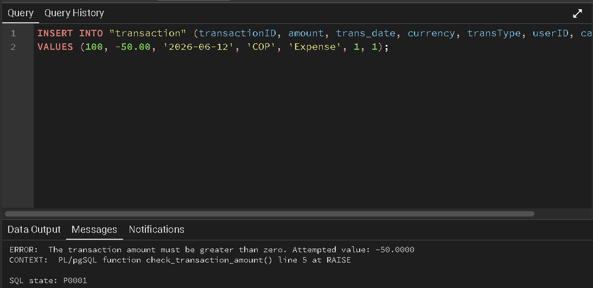
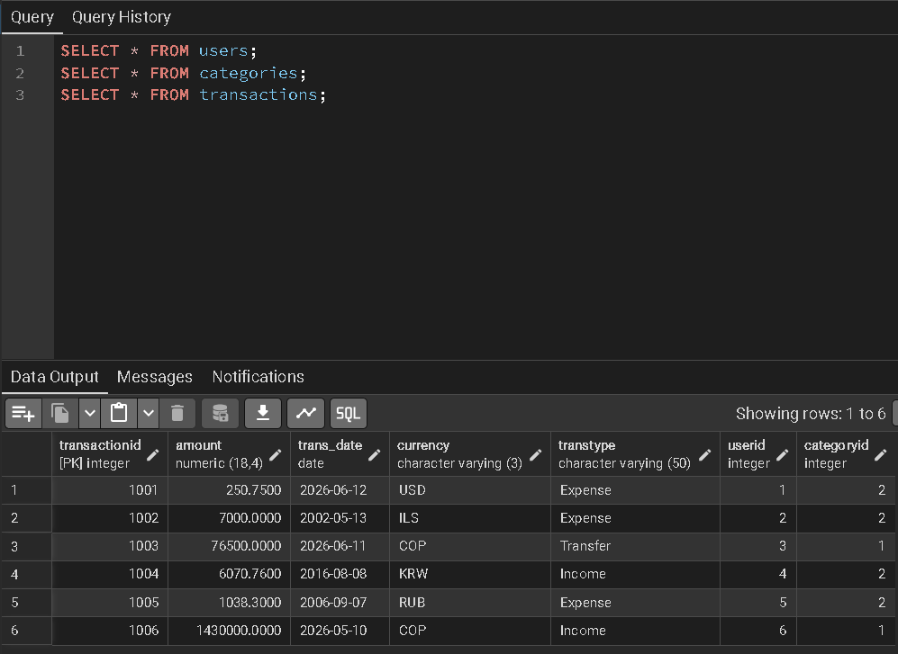
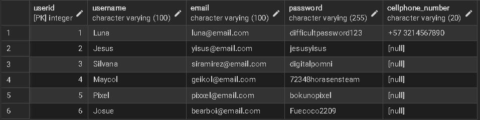

# BUDGETING - Control your expenses, free your future

## Description

The purpose of the Budgeting project is to facilitate the user's control over their personal finances through a relational database (PostgreSQL) that allows registering, visualizing, and analyzing expenses and income. The system offers a clear and accessible way to organize daily transactions, classify them by categories, set budgets, and generate periodic reports. For its development, fundamental concepts of Database Management Systems were implemented, such as DDL design for entities (users, transactions, budgets, and reports), integrity constraints with primary and foreign keys, optimization through unique indexes, DML queries, and triggers.

## Team Members

- Luna Sofia Santis Alvarez
- Silvana Ramírez Ardila
- Jesus Samuel Avellaneda Perico

## Languages and Tools

- SQL (Structured Query Language)
- PostgreSQL

## System Features

- Comprehensive User Management: Registration, storage, and control of unique profiles within the system.
- Transaction Registration and Classification: Detailed storage of income and expenses linked to personalized categories.
- Financial Budget Control: Configuration of maximum spending limits per category and user without duplication.
- Periodic Report Generation: Consolidation of financial histories structured by dates.
- Automated Data Validation: Server-side restriction (trigger) that prevents the entry of amounts less than or equal to zero.
- Performance Queries and Analysis: Chronological and optimized extraction of financial history through table joins.


## Project Structure

```
Budgeting/
│
├── README.md
└── database/
    ├── schema.sql              # DDL (tables, alterations, indexes)
    ├── triggers.sql            # Trigger code
    └── queries.sql             # Transaction query

```

## Installation Guide

1. Clone the repository:
```bash
git clone https://github.com/siramirezar-afk/BUDGETING-DB.git
```

2. Set up the database:
  -Create a new database named budgeting.
  -Open a Query Tool on the budgeting database and execute the scripts in the following order:
   
    Creates tables and indexes:
       database/schema.sql
   
    Creates the business rule validation trigger:
       database/triggers.sql 
  
   
3. Database Verification (Optional):
You can run the queries inside database/queries.sql to check performance queries and test data.


# Execution Evidence

## Test 1: Business Rule Validation (Trigger Error)
* **Description:** Attempt to insert a transaction with a negative amount (`-50.00`) to verify that the validation trigger successfully blocks the invalid operation and returns a custom error message.
* **Screenshot:**
  

## Test 2: Successful Database Setup and Data Insertion
* **Description:** Successful execution of the full DDL schema in pgAdmin, table creation verification inside the public schema tree, and successful insertion of valid records (users and categories).
* **Screenshots:**
  
  
  
